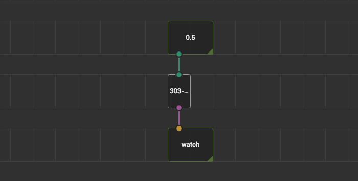

<!--
This file is auto-generated from the 'welcome-to-xod' project.
Do not change this file manually because your changes may be lost after
the tutorial update.

To make changes, change the 'welcome-to-xod' contents or 'before-1st-h2.md'.

If you want to change a Fritzing scheme or comments for it, change the
'before-1st-h2.md' in the documentation directory for the patch.

Then run auto-generator tool (xod/tools/generate-tutorial-docs.js).
-->

Note
This is a web-version of a tutorial chapter embedded right into the XOD IDE.
To get a better learning experience we recommend to install the
<a href="/downloads/">desktop IDE</a> or start the
<a href="/ide/">browser-based IDE</a>, and you’ll see the same tutorial there.

# Using Your New Node

Now you can use the new node just like any other.

## Instructions

1.  Drag’n’drop your `between` node from Project Browser to this patch and replace the `303-...` node with it.
2.  Add a few more `between`’s: double click on empty space and type “between”. Your node is here and denoted as `@/between`.
3.  Bind some values to the inputs of new `between` nodes, add some `tweak-number` and `watch` nodes to play.
4.  Run simulation to check how the new node works.

### Paths starting with @/

The at (_@_) symbol in the patch path shown by the quick search suggester denotes “_this project_”. That is, the node is located in the current projects, not in a library.

<- Place your `between` node instead

  

    <a href="../303-add-terminals/">← Previous lesson</a>
  

  

    <a href="../">Index</a>
  

  

    <a href="../305-document-it/">Next lesson →</a>
  

