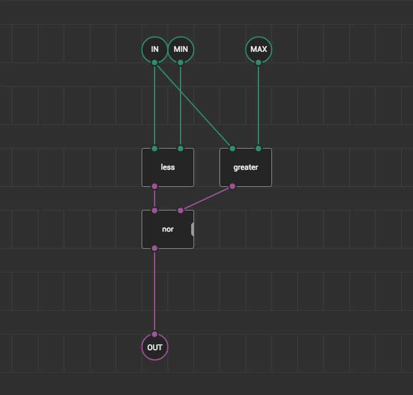

<!--
This file is auto-generated from the 'welcome-to-xod' project.
Do not change this file manually because your changes may be lost after
the tutorial update.

To make changes, change the 'welcome-to-xod' contents or 'before-1st-h2.md'.

If you want to change a Fritzing scheme or comments for it, change the
'before-1st-h2.md' in the documentation directory for the patch.

Then run auto-generator tool (xod/tools/generate-tutorial-docs.js).
-->

Note
This is a web-version of a tutorial chapter embedded right into the XOD IDE.
To get a better learning experience we recommend to install the
<a href="/downloads/">desktop IDE</a> or start the
<a href="/ide/">browser-based IDE</a>, and you’ll see the same tutorial there.

# Adding Documentation

The only thing our node lacks is proper documentation. The pins are unlabeled and the help panel does not describe what it does at all. Let's fix that.

## Instructions

Apply the instructions to your `between` node.

1. Using Inspector add descriptions to the terminal nodes. They will become pin descriptions in the help panel.
2. Click on any empty space on the patch to see the Inspector for the whole patch.
3. Add the description for the whole patch. It will become the node's description for the node in the help panel.
4. Invoke the help box to see how the documentation renders.

  

    <a href="../304-use-new-node/">← Previous lesson</a>
  

  

    <a href="../">Index</a>
  

  

    <a href="../306-next-steps/">Next lesson →</a>
  

