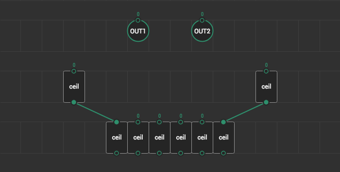

<!--
This file is auto-generated from the 'welcome-to-xod' project.
Do not change this file manually because your changes may be lost after
the tutorial update.

To make changes, change the 'welcome-to-xod' contents or 'before-1st-h2.md'.

If you want to change a Fritzing scheme or comments for it, change the
'before-1st-h2.md' in the documentation directory for the patch.

Then run auto-generator tool (xod/tools/generate-tutorial-docs.js).
-->

Note
This is a web-version of a tutorial chapter embedded right into the XOD IDE.
To get a better learning experience we recommend to install the
<a href="/downloads/">desktop IDE</a> or start the
<a href="/ide/">browser-based IDE</a>, and you’ll see the same tutorial there.

# Congratulations!

You have completed the tutorial. Hope you enjoyed it. May we ask to rate it?

[★★★★★ Excellent!](https://forum.xod.io/t/tutorial-feedback/457/?utm_source=ide&utm_medium=ide_comment&utm_campaign=tutorial_99&utm_term=5_stars)
[★★★★ Very Good](https://forum.xod.io/t/tutorial-feedback/457/?utm_source=ide&utm_medium=ide_comment&utm_campaign=tutorial_99&utm_term=4_stars)
[★★★ Okay](https://forum.xod.io/t/tutorial-feedback/457/?utm_source=ide&utm_medium=ide_comment&utm_campaign=tutorial_99&utm_term=3_stars)
[★★ So-so](https://forum.xod.io/t/tutorial-feedback/457/?utm_source=ide&utm_medium=ide_comment&utm_campaign=tutorial_99&utm_term=2_stars)
[★ Poor](https://forum.xod.io/t/tutorial-feedback/457/?utm_source=ide&utm_medium=ide_comment&utm_campaign=tutorial_99&utm_term=1_star)

If you would like to give more detailed feedback, we’ll happy to hear it on the rating page.

  

    <a href="../306-next-steps/">← Previous lesson</a>
  

  

    <a href="../">Index</a>
  

  

    
  

